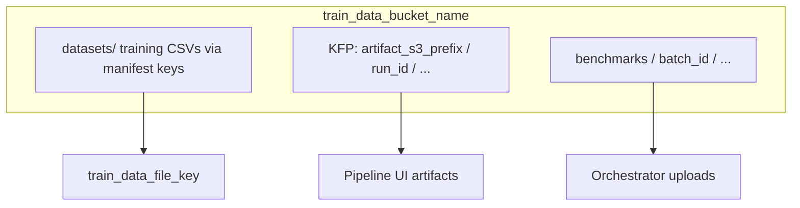

# S3 storage schema for benchmarks

This document describes how benchmark **inputs**, **KFP pipeline outputs**, and **orchestrator-uploaded results** are organized in object storage. It maps to [`templates/credentials.example.ini`](../templates/credentials.example.ini) sections `[storage]`, `[s3]`, and `[kfp]`.

## Credentials (no secrets in metadata)

| INI section | Keys used | Purpose |
|-------------|-----------|---------|
| `[storage]` | `train_data_bucket_name`, `artifact_s3_prefix`, `timeseries_artifact_s3_prefix`, `benchmark_s3_prefix`, `upload_benchmark_results` | Bucket name; KFP artifact root segment(s); namespace for uploaded benchmark bundles; toggle uploads |
| `[s3]` | `endpoint`, `aws_access_key_id`, `aws_secret_access_key`, `aws_default_region` | boto3 client for list/get (leaderboard discovery, download) and **put** (benchmark uploads) |
| `[kfp]` | `host`, `namespace`, `experiment_name` | Recorded in JSON metadata only (hosts/names, not tokens) |

Set `upload_benchmark_results = false` in `[storage]` to disable S3 uploads while keeping leaderboard discovery/download behavior.

**IAM**: the same principal as `[s3]` needs `s3:PutObject` (and typically `s3:ListBucket` for debugging) on keys under `{benchmark_s3_prefix}/**` and read access to existing training keys. Experiment dedupe also requires **`s3:GetObject`** on `{benchmark_s3_prefix}/experiment_index/**` and on historical `datasets/**/results.csv` paths referenced by the index.

## Experiment dedupe (skip identical runs)

By default the orchestrator **does not re-submit** a Kubeflow run when a prior **successful** run with the same fingerprint exists on S3.

1. **Fingerprint**: SHA-256 of canonical JSON over compiled IR hash, pipeline arguments, full manifest row fields, environment identity (KFP host/namespace/experiment, bucket, artifact prefixes, S3 endpoint host), and orchestrator options (`dataset_filter`, timeouts, `top_n`, caching, `run_name_prefix`).
2. **Index object**: `{benchmark_s3_prefix}/experiment_index/v1/{fingerprint}.json` — written after a successful per-dataset upload (same condition as SUCCEEDED state). It points at `results_csv_key`, `metadata_json_key`, and the expected `aggregated_merged_csv_key` for that batch.
3. **Restore**: On a cache hit, the orchestrator downloads `results.csv` via the index and appends that row (tags: `dedupe_cache_hit`, `experiment_fingerprint`, `dedupe_*_s3_uri`).

Disable skipping by passing **`--rerun-identical-experiments`** on [`scripts/benchmark_orchestrator.py`](../scripts/benchmark_orchestrator.py).

Dedupe works whenever `[s3]` credentials allow **GetObject** on the index, even if `upload_benchmark_results = false` for the current run (no index updates unless uploads succeed for SUCCEEDED runs).

## High-level layout



- **Training data**: Objects at keys given by each manifest row’s `train_data_file_key` (often under a `datasets/` prefix). Not moved by the orchestrator.
- **KFP runtime artifacts**: Under `{artifact_s3_prefix}/{run_id}/…` (e.g. `leaderboard-evaluation/…/html_artifact`). Owned by the pipeline runtime, not rewritten by this tool.
- **Benchmark bundles** (this feature): Under `{benchmark_s3_prefix}/{batch_id}/…`, written after each dataset run and again at the end of the suite.

Default `benchmark_s3_prefix` is `benchmarks` (configurable in `[storage]`).

## Orchestrator upload tree

For each orchestrator invocation, a **`batch_id`** is generated (UTC compact timestamp, e.g. `20260424T061410Z`).

```text
{benchmark_s3_prefix}/experiment_index/v1/{sha256}.json   # Dedupe index → prior results.csv (+ aggregated merged key)
{benchmark_s3_prefix}/{batch_id}/
  aggregated/
    merged_leaderboards.csv   # Long-form table: benchmark columns + parsed leaderboard HTML (same as merge_benchmark_leaderboards.py)
    benchmark_runs.csv        # Copy of local results CSV
    batch_metadata.json       # Batch summary (see below)
  datasets/
    {path_from_train_data_file_key}/
      results.csv             # One row: same columns as benchmark_runs for that dataset
      metadata.json           # Per-run provenance (see below)
      leaderboard.html        # Present if downloaded locally from KFP artifact
```

**Dataset folder path**: Derived from `train_data_file_key` by stripping a leading `datasets/` segment and the file extension, then sanitizing segments. Example: `datasets/classification/breast-w.csv` → `classification/breast-w`.

## `metadata.json` (per dataset run)

| Field | Description |
|-------|-------------|
| `schema_version` | Document version (e.g. `1.0`). |
| `timestamp` | ISO 8601 UTC when metadata was written. |
| `commit_hash` | `git rev-parse HEAD` from a detected repo root, or `null`. |
| `pipeline_definition` | `compiled_ir_path`, `compiled_ir_sha256`, `pipeline_template_name` (from IR `pipelineInfo.name`). |
| `pipeline_components` | Ordered `display_name` values from `metrics_blob.task_details` when present. |
| `input_params` | `top_n`, caching, timeouts, `dataset_filter`, `fail_fast`, manifest row, pipeline arguments, `artifact_s3_prefix`. |
| `downstream_dependencies` | Pointers to aggregated outputs (e.g. `aggregated/merged_leaderboards.csv`). |
| `environment_context` | `kfp_host`, `kfp_namespace`, `kfp_experiment_name`, bucket name, S3 region, endpoint **hostname** (no secrets), Python and platform. |
| `run_id`, `dataset_id` | KFP run UUID and manifest id. |
| `leaderboard_html_s3_uri` | Discovered KFP artifact URI. |
| `s3_benchmark_prefix` | S3 key prefix for this dataset’s folder. |
| `experiment_fingerprint` | SHA-256 fingerprint used for S3 dedupe (when uploads ran). |
| `dedupe_cache_hit` | `true` when this row was restored from S3 instead of re-running KFP. |

## `batch_metadata.json` (per orchestrator run)

| Field | Description |
|-------|-------------|
| `batch_id`, `started_at`, `finished_at` | Batch identity and timing. |
| `commit_hash` | Same as per-run when available. |
| `dataset_manifest_path` | Value from `benchmark.yaml` (relative path string). |
| `kfp_experiment_name` | From settings. |
| `benchmark_s3_prefix` | Configured prefix. |
| `dataset_ids` | Ordered list from result rows. |
| `benchmark_row_count` | Number of rows in `benchmark_runs.csv`. |
| `local_output_csv` | Output filename or path hint for the written CSV. |
| `cli_dataset_filter` | e.g. `all`, `tabular`, `timeseries`. |

## Example `metadata.json` (truncated)

```json
{
  "schema_version": "1.0",
  "timestamp": "2026-04-24T12:00:00+00:00",
  "commit_hash": "a1b2c3d4e5f6...",
  "pipeline_definition": {
    "compiled_ir_path": "/path/to/autogluon-tabular-training-pipeline.yaml",
    "compiled_ir_sha256": "...",
    "pipeline_template_name": "autogluon-tabular-training-pipeline"
  },
  "pipeline_components": ["autogluon-tabular-training-pipeline-xxx", "leaderboard-evaluation"],
  "input_params": {
    "top_n": 3,
    "dataset_filter": "all",
    "fail_fast": false,
    "manifest_dataset": { "id": "breast-w", "train_data_file_key": "datasets/classification/breast-w.csv" }
  },
  "downstream_dependencies": [
    {
      "name": "aggregated_merged_leaderboards",
      "relative_s3_key": "aggregated/merged_leaderboards.csv",
      "description": "Batch-level long-form CSV merged from leaderboard HTML tables"
    }
  ],
  "environment_context": {
    "kfp_host": "https://ds-pipeline-...",
    "kfp_namespace": "my-project",
    "kfp_experiment_name": "autogluon-benchmark",
    "train_data_bucket_name": "my-bucket",
    "s3_region": "us-east-1",
    "s3_endpoint_host": "s3.openshift-storage.svc",
    "python_version": "3.11.0",
    "platform": "..."
  },
  "run_id": "f9264c83-3395-4527-a06f-362a83c841eb",
  "dataset_id": "breast-w",
  "leaderboard_html_s3_uri": "s3://my-bucket/autogluon-tabular-training-pipeline/.../html_artifact",
  "s3_benchmark_prefix": "benchmarks/20260424T061410Z/datasets/classification/breast-w/"
}
```

## Operational notes

- **KMS / SSE**: Object encryption follows bucket policy; not set by this client.
- **Versioning**: Enable S3 versioning on the bucket if you need immutable audit history.
- **Separate artifact bucket**: Some environments store KFP UI artifacts in a different bucket than training data; the orchestrator currently uses `train_data_bucket_name` for uploads. Point training and IAM at the bucket where you want benchmark bundles to land, or extend configuration later with a dedicated results bucket.
